# Stryd Smartwatch Firmware

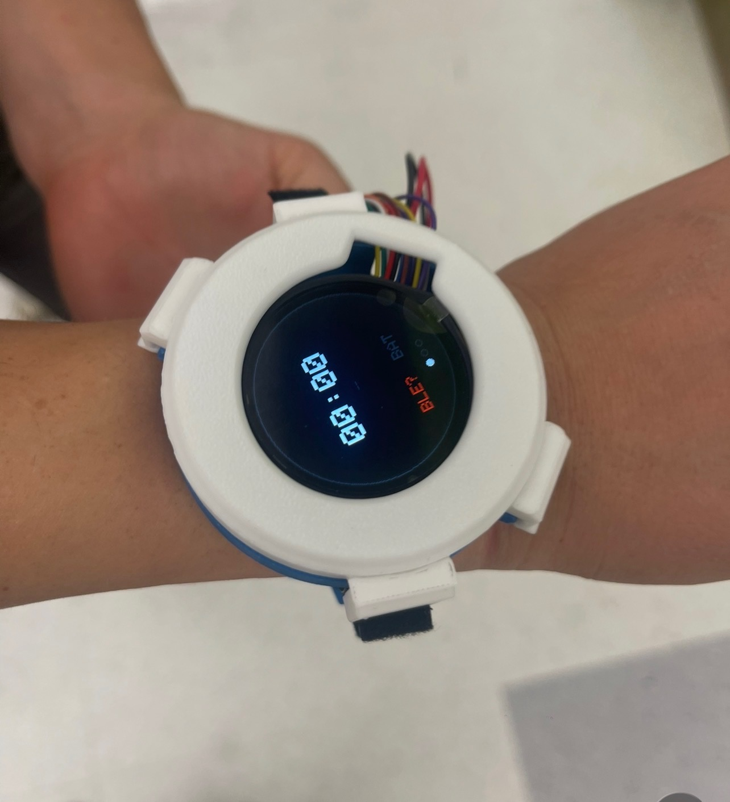

A wrist-worn fitness wearable built from a custom KiCad PCB, an ESP32-S3, a 1.28" round display, and a small zoo of I²C sensors. Final project for the **UC Berkeley HOPE DeCal**.

The watch tracks steps, skin temperature, barometric pressure, altitude, and outdoor weather, and renders everything on a swipeable round display. Weather streams over Wi-Fi from Open-Meteo. On-device human-activity recognition (HAR) is on the roadmap.

---

## Feature Tour

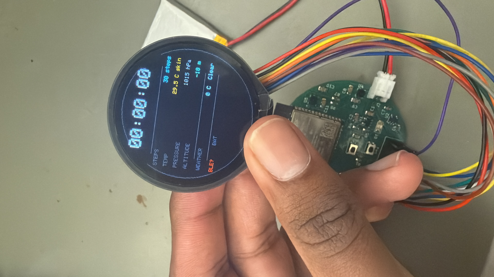

- **Round 240×240 watchface** rendered with Adafruit GFX into a GC9A01 framebuffer at 1 Hz.
- **Swipe navigation** — left/right swipes on the CST816S capacitive touch panel cycle through screens.
- **Step counting** via the LSM6DSO32's embedded pedometer (runs in parallel with raw accel/gyro sampling).
- **Skin temperature** from the MCP9808 (±0.25 °C).
- **Pressure + altitude** from the LPS25HB, altitude derived locally from pressure.
- **Outdoor weather** — Wi-Fi pulls current temperature + WMO weather code from Open-Meteo every 10 minutes.
- **BLE GATT server** exposes step / temp / pressure / altitude as notify characteristics; accepts time + weather writes from a paired phone (legacy path — Wi-Fi is now primary for weather).
- **Charge-state indicator** wired off the MCP73831's `CHG_STAT` line.

---

## Hardware

### MCU
- **ESP32-S3-WROOM-1** — dual-core Xtensa LX7 @ 240 MHz, 8 MB flash, Wi-Fi + BLE 5.0.

### Sensors (shared I²C bus @ 400 kHz)
| Sensor | Address | Purpose |
|---|---|---|
| LSM6DSO32 | `0x6A` | 6-axis IMU + pedometer |
| LPS25HB | `0x5C` | Barometric pressure / altitude |
| MCP9808 | `0x18` | Skin temperature |
| CST816S | `0x15` | Capacitive touch / gestures |

### Display
- **GC9A01** 1.28" round TFT, 240×240, SPI. Backlight on a dedicated GPIO.

### Power
- LiPo → MCP73831T charger → AP2112K-3.3V LDO → 3V3 rail.
- USB-C input with CC1/CC2 pulldowns.

Full pin map and module-by-module spec lives in [`stryd_firmware_context.md`](stryd_firmware_context.md).

---

## PCB Build

The board is a 4-layer round PCB, ~38 mm diameter, designed in KiCad and fabbed at JLCPCB.

| Step | Photo |
|---|---|
| **1. Bare PCB, top side** — populated with ESP32-S3 module, side buttons, USB-C | 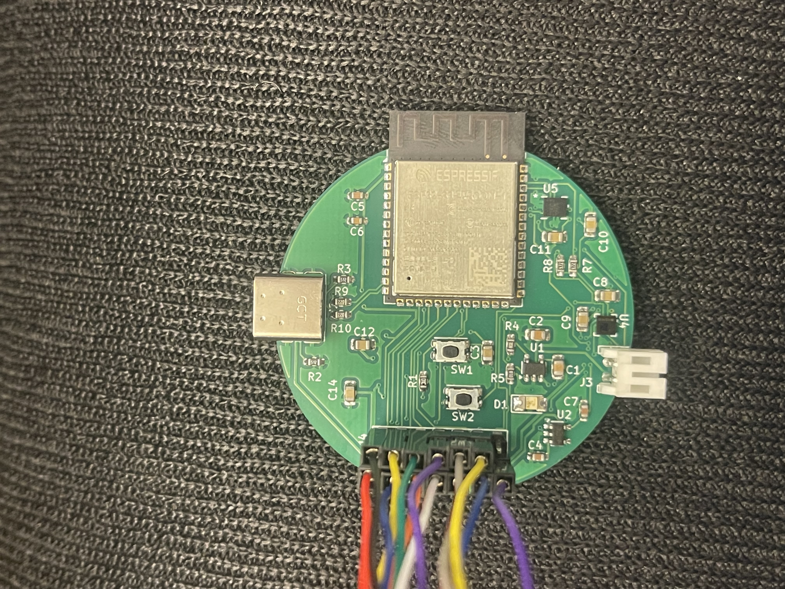 |
| **2. Bare PCB, bottom side** — sensor footprints + pin headers for bring-up | 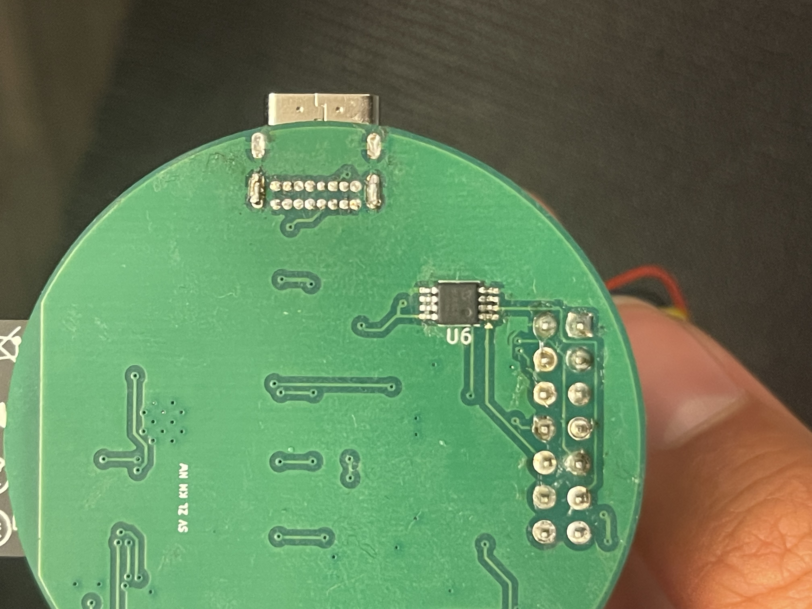 |
| **3. Reflow** — paste-stencil + components placed by hand, baked in a T-962 | 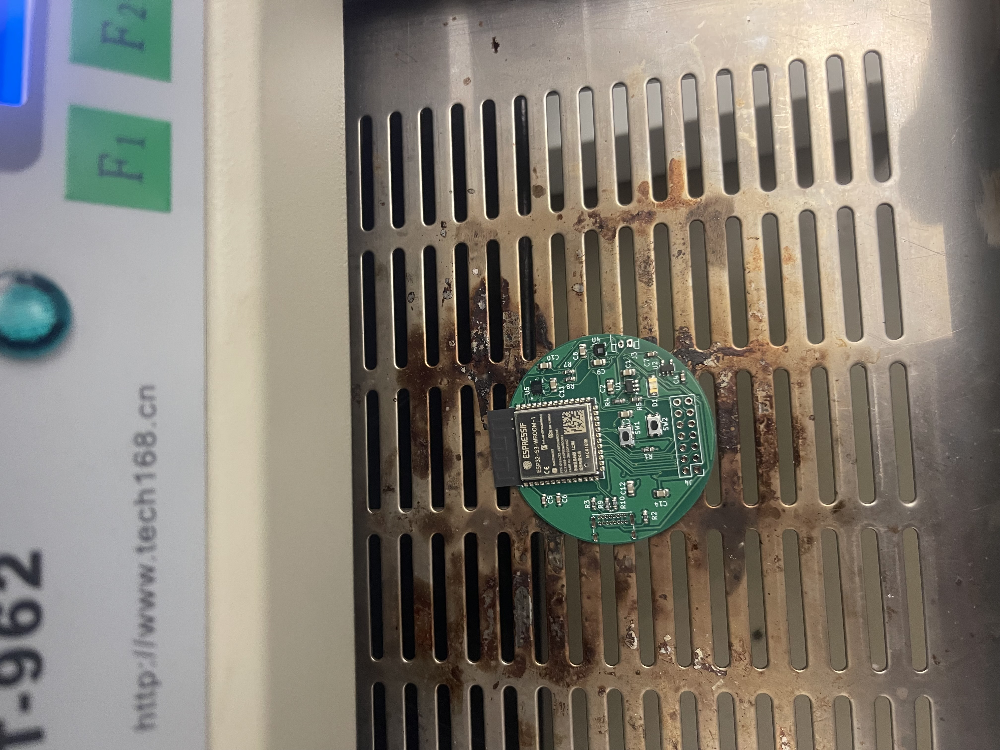 |
| **4. Post-reflow inspection + touch-up** — flux residue cleaned, hand-solder anything that tombstoned | 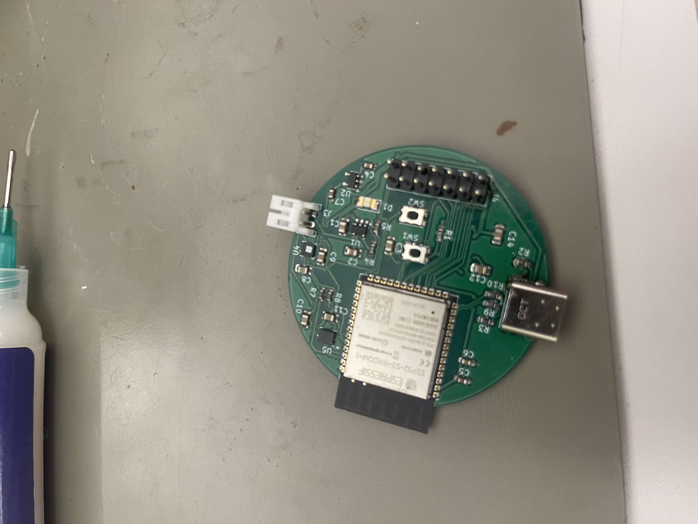 |

**BOM highlights:** ESP32-S3-WROOM-1, GC9A01 module, LSM6DSO32, LPS25HB (LPS25HBTR), MCP9808 (MSOP-8), CST816S (on the display flex), MCP73831T charger, AP2112K-3.3V LDO, USB-C receptacle with 5.1 kΩ CC pulldowns.

---

## Firmware Build & Flash

The sketch builds against **Arduino-ESP32 v2.0.17** (pinned — the BLE API was rewritten in v3.x).

### Arduino IDE

1. Install Arduino IDE 2.x.
2. Tools → Board → Boards Manager → install **esp32 by Espressif Systems v2.0.17**.
3. Library Manager — install:
   - Adafruit GC9A01A
   - Adafruit GFX Library
   - Adafruit BusIO
4. Board settings:
   - Board: **ESP32S3 Dev Module**
   - **USB CDC On Boot: Enabled** (required for serial output on native USB)
   - PSRAM: **OPI PSRAM**
   - Flash Size: **8 MB**
5. Copy `smartwatch/secrets.example.h` → `smartwatch/secrets.h` and fill in your Wi-Fi credentials and coords (see [Wi-Fi setup](#wi-fi-setup)).
6. Open `smartwatch/smartwatch.ino`, pick the right serial port, click Upload.

### arduino-cli (optional)

```bash
arduino-cli core install esp32:esp32@2.0.17
arduino-cli lib install "Adafruit GC9A01A" "Adafruit GFX Library" "Adafruit BusIO"
arduino-cli compile --fqbn esp32:esp32:esp32s3:USBMode=hwcdc,CDCOnBoot=cdc,PSRAM=opi smartwatch
arduino-cli upload  --fqbn esp32:esp32:esp32s3:USBMode=hwcdc,CDCOnBoot=cdc,PSRAM=opi -p /dev/cu.usbmodemXXXX smartwatch
```

---

## Bring-up

Bring-up was done in two phases: first on the bare PCB with flying jumper wires to a breakout display and breadboard for sensors, then in the 3D-printed case.

| Step | Photo |
|---|---|
| **1. PCB seated in 3D-printed case, display attached via flex** | 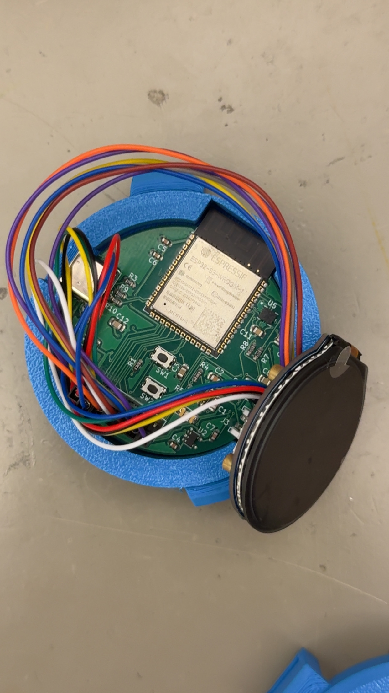 |
| **2. Case opened to verify display + sensor wiring before bezel** | 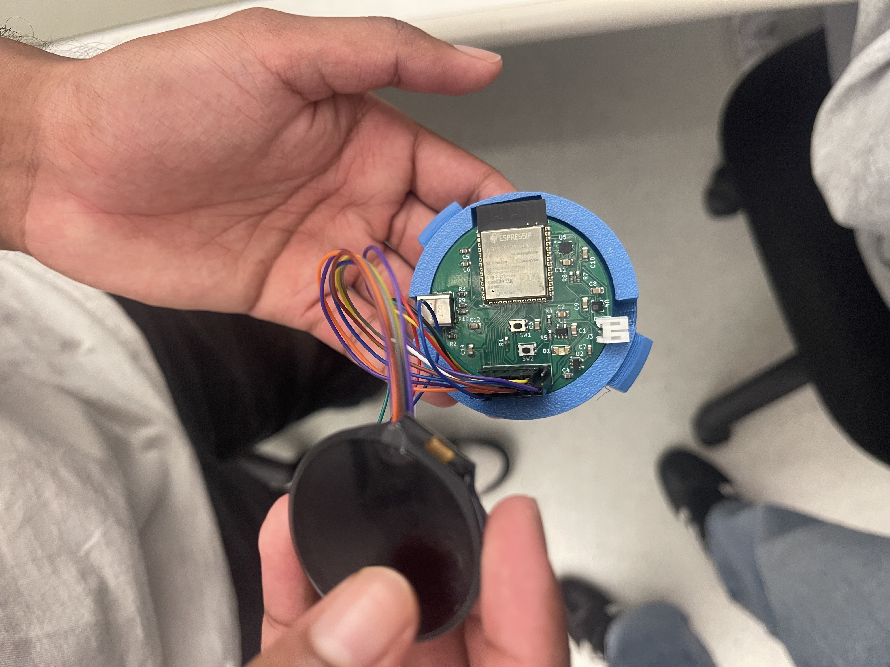 |
| **3. Wrist-mount test with flying wires** — verify sensors behave on a moving arm | 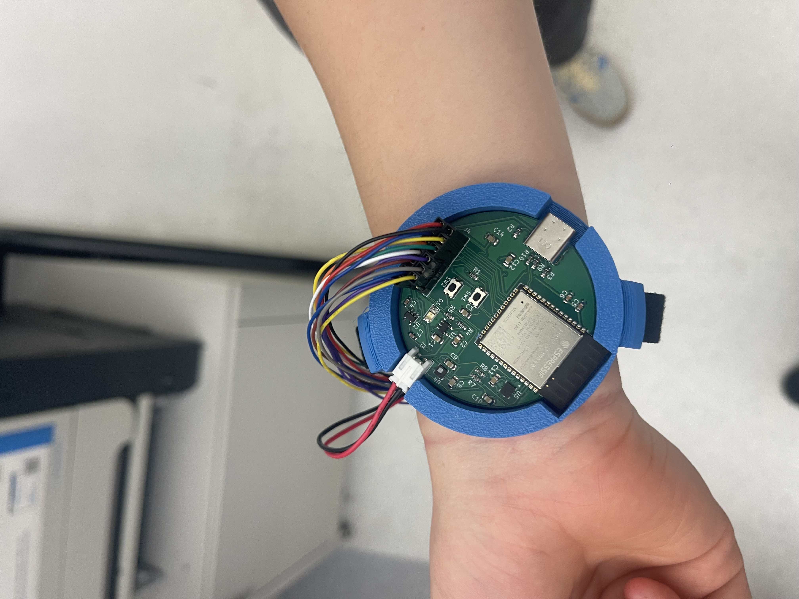 |
| **4. Same test, different angle — check IMU step-counting on a walk** | 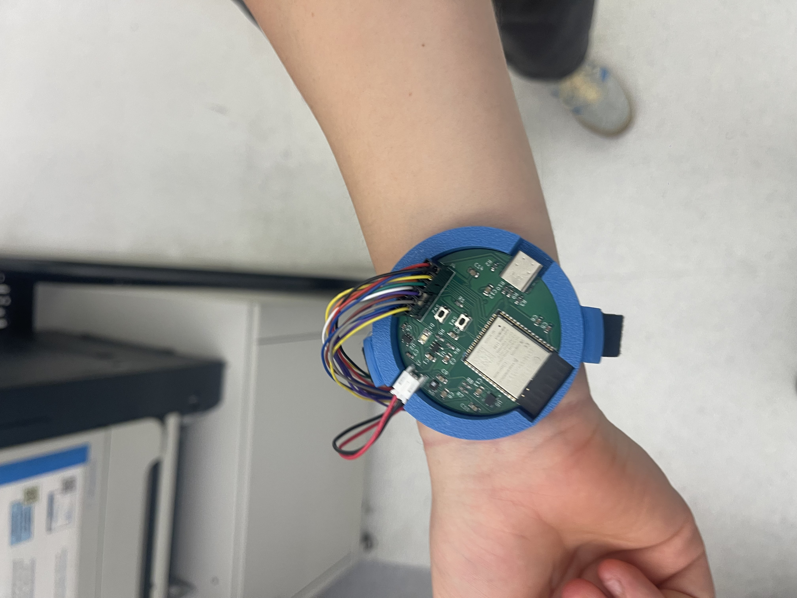 |
| **5. Velcro strap fitted, debug wires curled** | 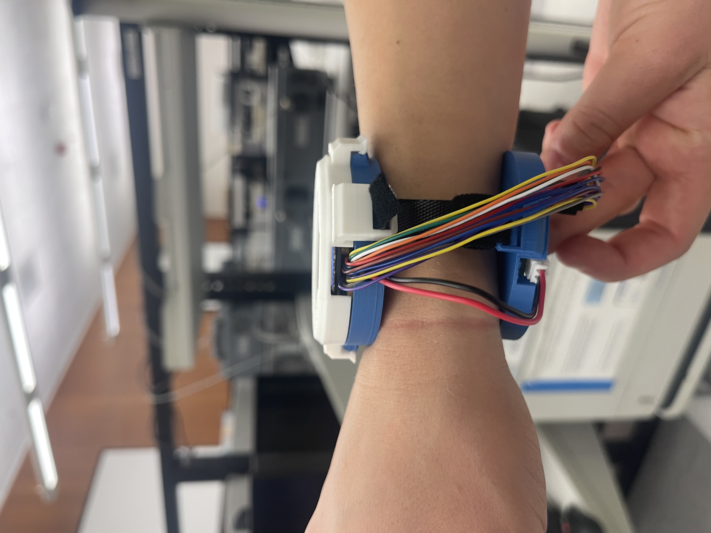 |
| **6. Tethered debugging via USB-C to laptop** | 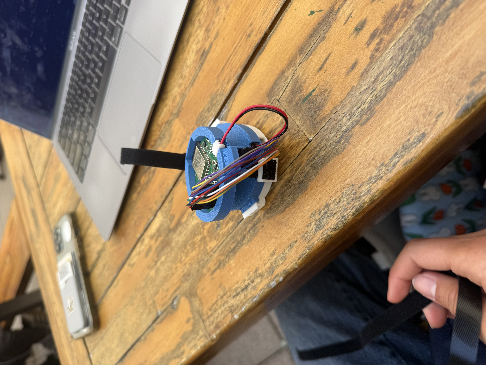 |
| **7. Final assembled watch with white bezel** | 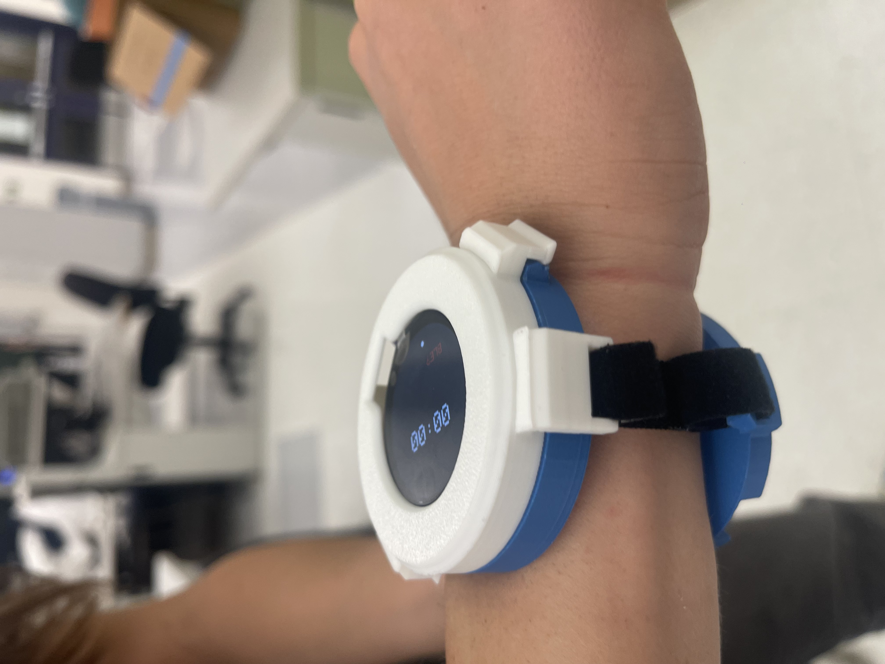 |

### First-boot checklist
1. Plug into USB, open Serial Monitor at **115200 baud**.
2. Expect:
   ```
   [BOOT] Smartwatch starting...
   [TOUCH] CST816S found at 0x15!
   [I2C] Found 0x18      ← MCP9808
   [I2C] Found 0x5C      ← LPS25HB
   [I2C] Found 0x6A      ← LSM6DSO32
   [BOOT] Ready.
   ```
3. After a few seconds, `[WIFI] state: CONNECTED` then `[WX] 18.4 C  code=3` once the first weather pull lands.
4. Display should show the watchface. Swipe left/right to navigate screens.

---

## Wi-Fi Setup

Wi-Fi credentials and your location live in `smartwatch/secrets.h` (gitignored). Copy from the template and fill in:

```c
#define WIFI_SSID    "YourNetwork"
#define WIFI_PASS    "YourPassword"
#define WEATHER_LAT   37.7749f
#define WEATHER_LON  -122.4194f
```

Caveats:
- ESP32 radios are **2.4 GHz only**. If you're using an iPhone hotspot, turn on Settings → Personal Hotspot → **Maximize Compatibility** so the phone broadcasts on 2.4 GHz.
- Public/captive networks (coffee-shop Wi-Fi, hotel splash pages) won't work — there's no browser to dismiss the captive portal.
- The watch polls Open-Meteo every 10 minutes; adjust `WEATHER_REFRESH_MS` in `smartwatch/wifi_weather.h` if you want it more aggressive.

Lat/long can be grabbed by right-clicking your location in Google Maps.

---

## ML Training Roadmap

On-device **Human Activity Recognition (HAR)** is the next milestone. The pipeline below is planned, not yet implemented.

1. **Data collection.** Stream IMU samples (52 Hz accel + gyro) over BLE to a paired laptop while wearing the watch and performing labelled activities (walking, running, sitting, climbing stairs, idle). Target: ~30 min per class across multiple sessions and wearers.
2. **Preprocessing.** Window the stream into ~2.5 s segments (128 samples @ 52 Hz) with 50 % overlap. Normalize per-axis. Hold out 20 % for validation, 10 % for test.
3. **Model.** Lightweight 1-D CNN over the 6-axis IMU window (~10 k parameters target so it fits in flash and runs in <30 ms on the LX7 with vector ops). Train in TensorFlow / Keras.
4. **Quantization.** Post-training int8 quantization via TFLite. Verify accuracy delta vs. float32 stays under ~2 %.
5. **Deployment.** Convert to a C array via `xxd -i`, link against **TensorFlow Lite Micro for Espressif**. Run inference every ~2 s in a low-priority FreeRTOS task.
6. **Surface results.** Add an `activity` field to `WatchState`, render the current activity on a new screen, and notify it over BLE.

Training code, dataset capture scripts, and quantization recipe will live under `tools/ml/` once they exist.

---

## Repository Layout

```
.
├── smartwatch/                # Arduino sketch — flash this
│   ├── smartwatch.ino         # Main loop, sensor + display orchestration
│   ├── watchface.h            # WatchState struct
│   ├── watchface_impl.h       # Screen rendering
│   ├── display.h              # GC9A01 init
│   ├── imu.h                  # LSM6DSO32 driver + pedometer
│   ├── barometer.h            # LPS25HB driver
│   ├── temperature.h          # MCP9808 driver
│   ├── touch.h                # CST816S driver + gesture debounce
│   ├── ble_service.h          # BLE GATT server
│   ├── wifi_weather.h         # Wi-Fi + Open-Meteo client
│   └── secrets.h              # (gitignored) Wi-Fi creds + lat/lon
├── tools/
│   └── weather_push.py        # Legacy: laptop-side BLE weather pusher
├── images/                    # README photos
├── stryd_firmware_context.md  # Full hardware + firmware reference
└── OUTDATED HOPE Smart Watch Firmware/   # Pre-refactor snapshot, kept for diffing
```

---

## Acknowledgments

Built for the **UC Berkeley HOPE DeCal** (Spring 2026, Group 14).
Hardware design in KiCad. Firmware on Arduino-ESP32. Weather data courtesy of [Open-Meteo](https://open-meteo.com).
